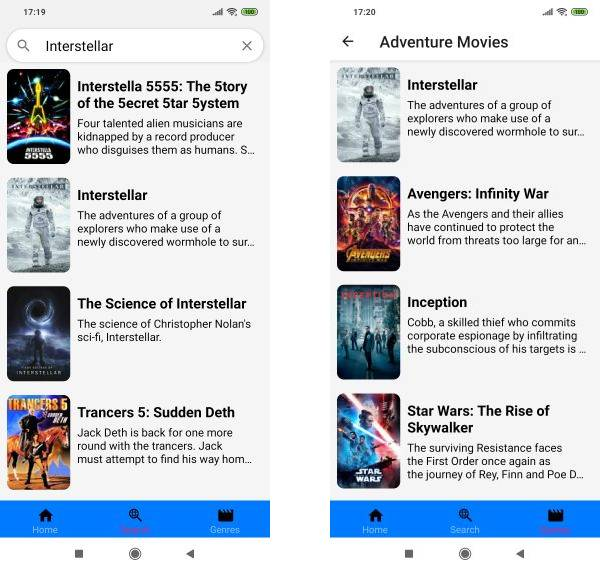

<h1 align="center">    
    📽Cinne Lead📽
</h1>

<h4 align="center">
  A React Native mobile client for TheMovieDB. Displays movies that are now playing in theaters, lets the user search movies by movie name or genres. It was made with accessibility in mind, it is TalkBack and font scaling friendly with high contrast colors.
</h4>

<p align="center">
    
</p>

## 📑How To Use

To clone and run this application, you'll need [Git](https://git-scm.com), [Node.js v12.18.2](https//nodejs.org) or higher + [Yarn v2.0](https://yarnpkg.com) or higher installed on your computer and [Expo SDK38](https://expo.io) on your mobile phone. You will also need an API Key from [TheMovieDB](https://www.themoviedb.org/). From your command line:

```bash
# Clone this repository
$ git clone https://github.com/RohanMelo/cinne-lead

# Go into the repository
$ cd cinne-lead

# Install dependencies
$ yarn

# Insert your API Key on the environment.js file under "dev"
$ apiKey: Enter MovieDB API Key here to run the app

# Run the app
$ yarn start

# Open the app in Expo using the QR code

```

## 📚Tech Stack
* React Native
* Expo
* Redux
* React Navigation v5
* Axios


## ⚖License
This project is licensed under the terms of the MIT license.